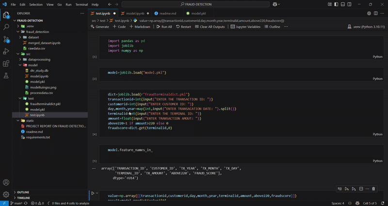

## Demo


# FRAUD DETECTION

This project aims to build an intelligent fraud detection system that analyzes transaction patterns and identifies suspicious activities in real-time. Using machine learning algorithms like Decision Trees, Random Forest, and Neural Networks, the system learns from historical transaction data to detect anomalies. It focuses on minimizing false positives while ensuring early detection of fraudulent transactions. The model will be trained on features like transaction amount, location, time, device used, and customer behavior patterns. The final system can be integrated into banking apps to automatically flag or block suspicious transactions


## Features

- Detects fraudulent transactions automatically.
- Real-time fraud alerts.
- High accuracy with machine learning models.


## Techstack

- Programming Language: Python

- Libraries and Frameworks:

      Scikit-learn

      XGBoost

      Optuna

      Optuna Dashboard

      NumPy

      Pandas

      Imbalanced-learn (imblearn)


## Documentation

[ FRAUD DETECTION PDF](https://www.linkedin.com/in/avijit-bhadra-990a65253/overlay/1745657069807/single-media-viewer?type=DOCUMENT&profileId=ACoAAD6gdTwBExtFWmyKB5oEDGmjLi0SpW8Ed_Y&lipi=urn%3Ali%3Apage%3Ad_flagship3_profile_view_base%3B5Qv1RbXoS8mRmYsEWDOVtQ%3D%3D)


## PROBLEM STATEMENT
```bash
Problem Statement: Fraud Transaction Detection Using Transactions Dataset
Objective:
Build an accurate and efficient machine learning model that can automatically classify transactions as either fraudulent or legitimate based on transaction details.

Background:
In the financial sector, detecting fraudulent transactions quickly and accurately is critical to minimize losses and maintain customer trust. The dataset provided is a simulated transaction dataset that includes both normal and fraudulent activities, based on three specific fraud generation scenarios:

High-Amount Frauds: Any transaction where the amount exceeds 220 units is labeled as fraud.

Compromised Terminals: Two random terminals each day are compromised; transactions on these terminals for the next 28 days are marked as fraudulent.

Compromised Customers: Three random customers each day have their credentials leaked; for the next 14 days, 1/3 of their transactions (with amounts multiplied by 5) are considered fraudulent.

Dataset Description:
Each transaction in the dataset contains the following key attributes:

TRANSACTION_ID: Unique transaction identifier.

TX_DATETIME: Timestamp of the transaction.

CUSTOMER_ID: Unique customer identifier.

TERMINAL_ID: Unique terminal identifier.

TX_AMOUNT: Transaction amount.

TX_FRAUD: Label indicating if the transaction is fraudulent (1) or legitimate (0).

Task:

Analyze the dataset and understand the patterns of fraud generation.

Engineer meaningful features based on transaction amount, customer behavior, and terminal usage.

Build and evaluate machine learning models capable of accurately predicting the TX_FRAUD label.

Use the given scenarios to improve fraud detection performance, such as by tracking spending habits and terminal-specific fraud history.

Validate your model's performance using appropriate classification metrics (Accuracy, Precision, Recall, F1-Score, ROC-AUC).
```


## Installation

Install my-project with github

```bash
Clone the repository
git clone git clone https://github.com/CodewithAvijit/fraud-detection.git

Navigate into the project directory
cd fraud-detection

Create a virtual environment
python -m venv venv
source venv/bin/activate  # On Linux/Mac
venv\Scripts\activate     # On Windows

Install the required packages
pip install -r requirements.txt

```

## Running Tests

```bash
use jupyter notebook  and run model.ipynb
```


## Authors

- [@codewithAvijit](https://github.com/CodewithAvijit)


## output


## License
This project is licensed under the MIT License - see the [LICENSE](https://choosealicense.com/licenses/mit/) file for details.