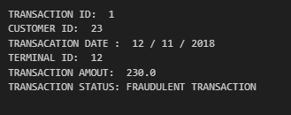

# FRAUD DETECTION

This project aims to build an intelligent fraud detection system that analyzes transaction patterns and identifies suspicious activities in real-time. Using machine learning algorithms like Decision Trees, Random Forest, and Neural Networks, the system learns from historical transaction data to detect anomalies. It focuses on minimizing false positives while ensuring early detection of fraudulent transactions. The model will be trained on features like transaction amount, location, time, device used, and customer behavior patterns. The final system can be integrated into banking apps to automatically flag or block suspicious transactions


## Features

- Detects fraudulent transactions automatically.
- Real-time fraud alerts.
- High accuracy with machine learning models.


## Techstack

- Programming Language: Python

- Libraries and Frameworks:

      Scikit-learn

      XGBoost

      Optuna

      Optuna Dashboard

      NumPy

      Pandas

      Imbalanced-learn (imblearn)


## Documentation

[ FRAUD DETECTION PDF](https://www.linkedin.com/in/avijit-bhadra-990a65253/overlay/1745657069807/single-media-viewer?type=DOCUMENT&profileId=ACoAAD6gdTwBExtFWmyKB5oEDGmjLi0SpW8Ed_Y&lipi=urn%3Ali%3Apage%3Ad_flagship3_profile_view_base%3B5Qv1RbXoS8mRmYsEWDOVtQ%3D%3D)


## Installation

Install my-project with github

```bash
Clone the repository
git clone git clone https://github.com/CodewithAvijit/fraud-detection.git

Navigate into the project directory
cd fraud-detection

Create a virtual environment
python -m venv venv
source venv/bin/activate  # On Linux/Mac
venv\Scripts\activate     # On Windows

Install the required packages
pip install -r requirements.txt

```

## Running Tests

```bash
use jupyter notebook  and run model.ipynb
```


## Authors

- [@codewithAvijit](https://github.com/CodewithAvijit)


## prediction output



## License
This project is licensed under the MIT License - see the [LICENSE](LICENSE) file for details.